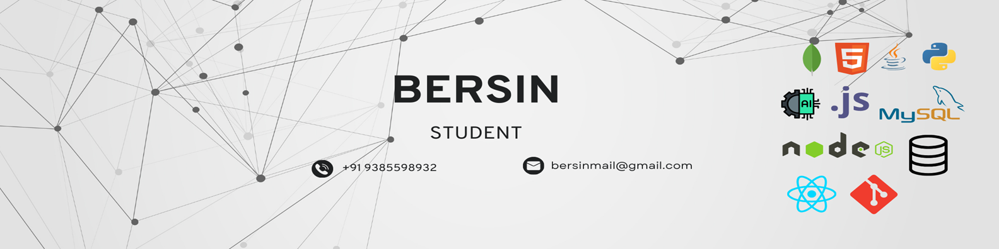

# 👋 Hi there, I'm Bersin S!  

```python
from developer import Bersin

class AboutMe(Bersin):
    def __init__(self):
        self.roles = ["ML Engineer", "Web Developer", "Backend Enthusiast"]
        self.tech_stack = ["Java", "Python", "JavaScript", "Node.js", "React", "MongoDB", "Firebase"]
        self.fun_fact = "I almost always use AI to write code!"

    def say_hi(self):
        print("Welcome to my GitHub profile!")

me = AboutMe()
me.say_hi()
```

## 🚀 Tech Stack


---

## 📊 GitHub Stats & Contributions

<p align="center">
  
  
</p>

<p align="center">
  
</p>

---

## 🎉 Fun Facts

- 🔥 I love working with AI and automation
- 🤖 I experiment with machine learning models in my free time
- 🚀 I’m passionate about building innovative tech solutions
- 🎮 I enjoy gaming and tinkering with hardware setups

---

## 🌐 Connect with Me

[](https://linkedin.com/in/bersins)  
[](https://leetcode.com/bersins)  
[](https://discord.com/users/bersins)  
[](mailto:bersins@example.com)  

---

## 🌀 Animated Fun!

<p align="center">
  
</p>

<p align="center">
  
</p>

---

_✨ Thanks for stopping by! Have an awesome day! 🚀_
