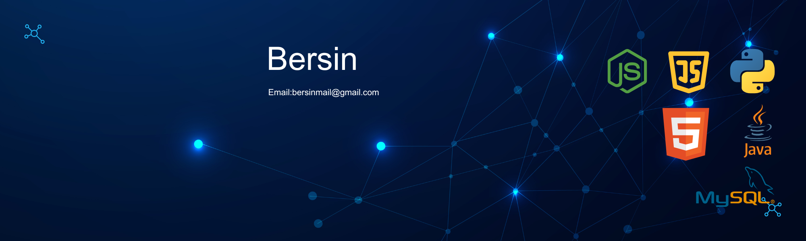

  

## 🚀 Tech Stack

---

## 🎯 Skill Progress

| Skill          | Proficiency |
|---------------|------------|
| JavaScript    |  |
| Python        |  |
| Java          |  |
| C             |  |
| MySQL         |  |
| Node.js       |  |
| MongoDB       |  |
| HTML/CSS      |  |
| Git/GitHub    |  |

  

---

## 📊 GitHub Stats & Contributions

  
  

  

<!-- Animated Contribution Graph -->

  

  

---

## 🏆 Achievements & Contributions

  

---

## 🌐 Connect with Me  

  
  
  
  

---

_✨ Thanks for stopping by! Have an awesome day! 🚀_
